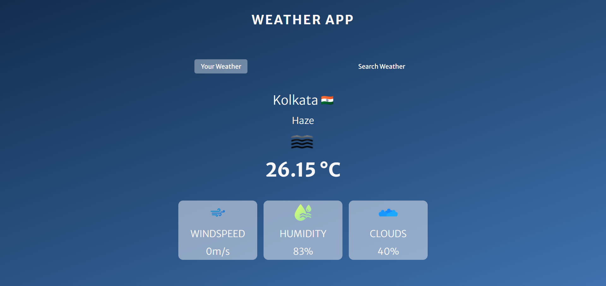
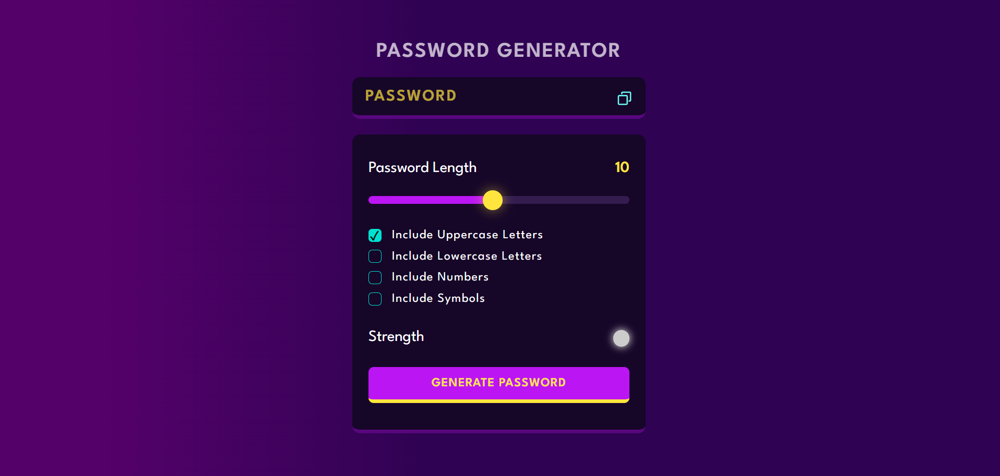

# Hello, I'm Sk. Imran Hussain 👋

Passionate Front-End Developer | React.js | Tailwind CSS | JavaScript | CSS3 | HTML5 | Git | GitHub. 🚀

## 👨‍💻 About Me
🌐 I'm an enthusiastic web developer with a strong skill set in React.js, Tailwind CSS, JavaScript, CSS3, HTML5, Git, and GitHub.

🚀 My passion lies in creating captivating websites with a focus on responsive design and user-centric experiences.

🎨 I leverage Tailwind CSS to craft efficient and visually appealing interfaces, and I infuse interactivity and dynamism into my projects using JavaScript.

🤝 Collaborative and detail-oriented, I prioritize effective version control with Git and GitHub, ensuring seamless teamwork and efficient code management.

📚 Committed to continuous learning and staying updated, I'm excited to contribute to innovative web projects and eager to connect for opportunities!

✍️ In my leisure moments, I indulge in the art of writing, exploring realms beyond coding.

## 🛠️ Tech Stack

## 📫 Let's Connect

## 🚀 My Projects

## 💡 Fun Facts
- 🖋️ In my moments of leisure, I'm captivated by the art of storytelling through the written word.

## 🏆 Trophies:

📊 GitHub Stats
 
 

📈 My GitHub Top Languages
 
 

👁️ Visitors

Let's connect and build something amazing together! 🚀
