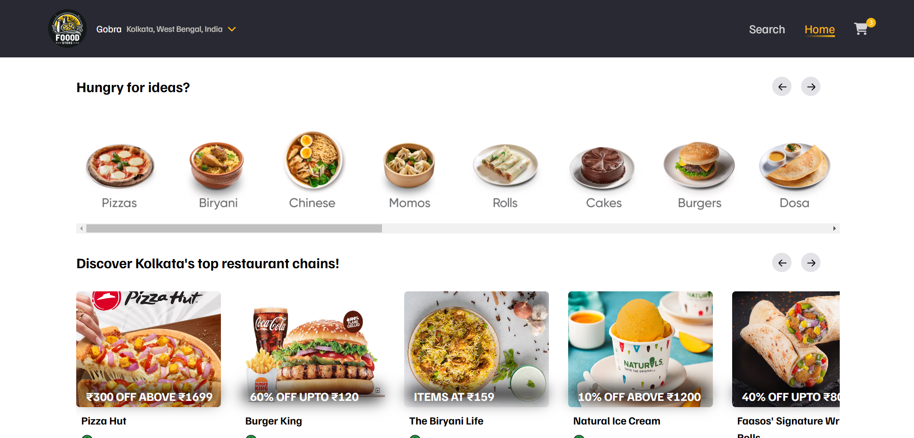
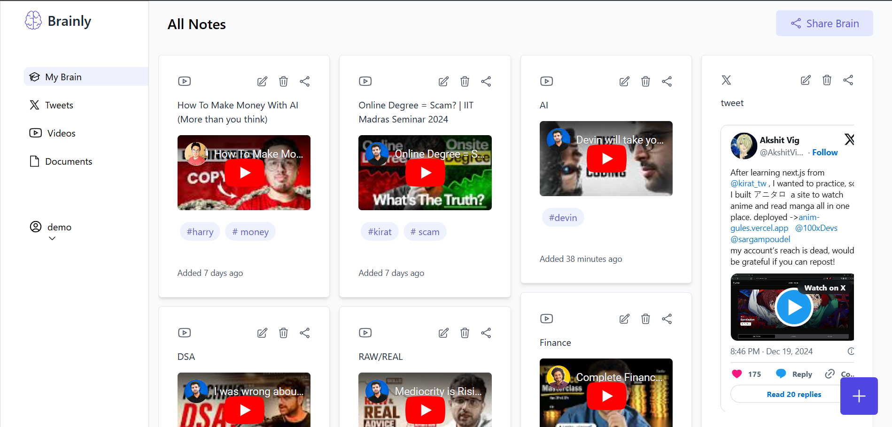
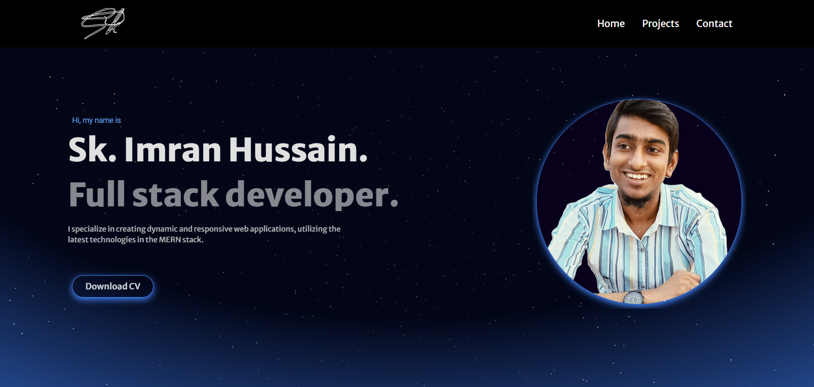
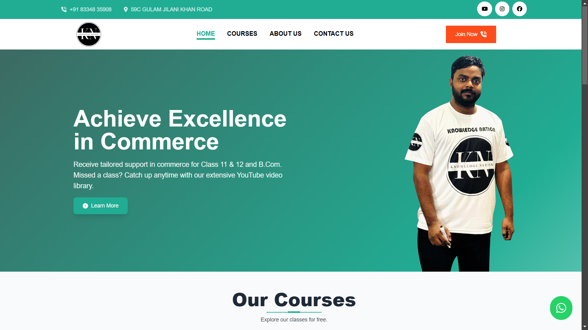

# Hello, I'm Sk. Imran Hussain 👋

Full-Stack Developer | MERN Stack | PostgreSQL | Prisma | Next.js | Redux | Git | Firebase

## 👨‍💻 About Me
🌐 I'm an enthusiastic full-stack developer with expertise in MERN stack, PostgreSQL, Prisma, and modern tools like Next.js, Monorepo, and Turborepo.

🚀 My passion lies in creating scalable, efficient, and responsive web applications with seamless user experiences.

🎨 I excel in crafting efficient and visually appealing interfaces using React and Tailwind CSS, while leveraging robust backend systems with Node.js, Express.js, and PostgreSQL.

🤝 Collaborative and detail-oriented, I prioritize effective version control with Git and GitHub, ensuring seamless teamwork and efficient code management.

📚 Committed to continuous learning and staying updated, I'm excited to contribute to innovative web projects and eager to connect for opportunities!

✍️ In my leisure moments, I indulge in the art of writing, exploring realms beyond coding.

## 🛠️ Tech Stack

## 📫 Let's Connect

## 🚀 My Projects

## 💡 Fun Facts
- 🖋️ In my moments of leisure, I'm captivated by the art of storytelling through the written word.

## 🏆 Trophies:

📊 GitHub Stats
 
 

📈 My GitHub Top Languages
 
 

👁️ Visitors

Let's connect and build something amazing together! 🚀
